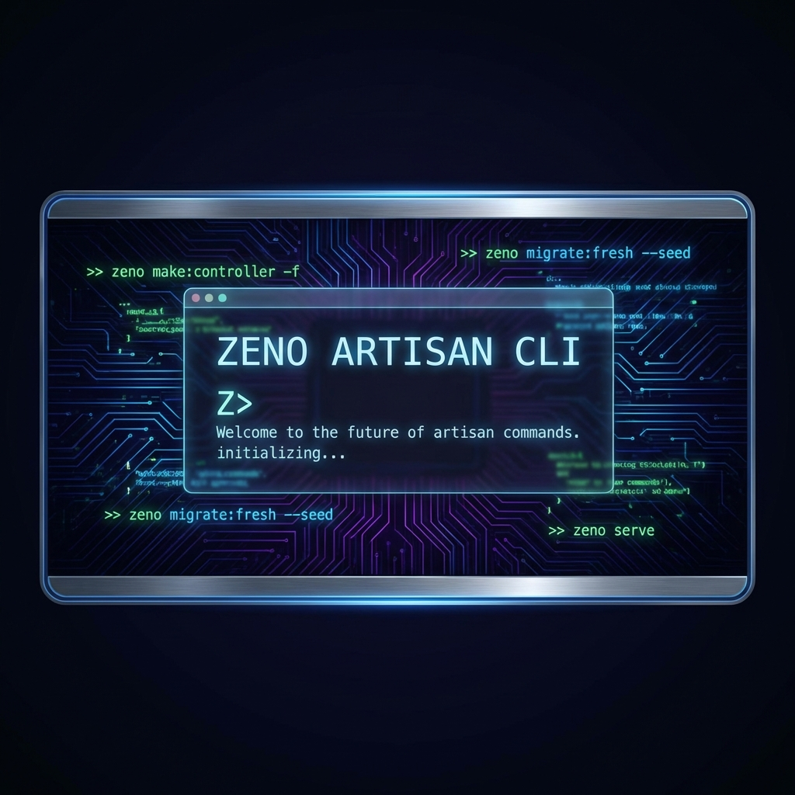

# Zeno-X Framework Example



This is a working example of the Zeno-X Framework structure.

## 🚀 Critical Lessons Learned (Pengalaman Development)

### 1. Route Syntax is Strict
Routes **MUST** wrap their logic in a `do { ... }` block. Without this, the router matches the URL but does not execute the handler (returns empty 200 OK).

**✅ Correct:**
```zenolang
http.get: '/contact' {
    do: {
        return: view('contact')
    }
}
```

**❌ Incorrect (Silent Failure):**
```zenolang
http.get: '/contact' {
    return: view('contact')
}
```

### 2. View Rendering
Use `view.blade: "filename"` or `view('basename')`.
Ensure the view file exists in `views/` directory.

### 3. AI Artisan (`ai_dev.zl`)
The `ai_dev.zl` script is designed to generate code using Gemini.
- If API Keys fail (404/403), the script can be bypassed by manually creating files in `app/controllers`, `views`, and `routes`.
- Ensure `.env` has `GEMINI_API_KEY` loaded if attempting to use it.

### 4. Security Configuration
The framework middleware (`securecookie`) requires 32-byte keys in `.env`:
- `APP_KEY`, `HASH_KEY`, `BLOCK_KEY`

---
 
 ## 🛠️ Zeno Artisan CLI (The "Laravel Killer")
 
 Zeno Artisan adalah tool baris perintah untuk mempercepat development, sekarang sudah didukung oleh **Zeno Metaprogramming**.
 
 ### Perintah Utama
 Jalankan menggunakan execute script:
 ```bash
 # Membuat Controller baru
 .\zeno.exe run artisan.zl make:controller ProfileController
 
 # Membuat Migration baru
 .\zeno.exe run artisan.zl make:migration create_users_table
 ```
 
 ### 🧩 Metaprogramming: Code as Data
 Artisan menggunakan sistem **Stubs** yang tersimpan di `views/stubs/`. Setiap file di-generate menggunakan engine `meta.template`, sehingga boilerplate-nya sangat bersih dan mudah dimodifikasi.
 
 ---
 
 ## 🗄️ ZenoORM: Fluent Migrations
 
 Zeno-X sekarang mendukung migrasi berbasis kode (DDL) tanpa perlu menulis raw SQL.
 
 ### Contoh Migration (`database/migrations/*.zl`)
 ```zenolang
 schema.create: 'products' {
     column.id: 'id'
     column.string: 'name'
     column.integer: 'price'
     column.timestamps
 }
 ```
 
 ### Keunggulan Engine
 Zeno Engine sekarang sudah mendukung:
 - **Global `$args`**: Argument CLI otomatis masuk ke scope script.
 - **Schema Builder**: Abstract DDL yang mendukung SQLite, MySQL, dan Postgres.
 - **Metaprogramming**: Rendering kode dinamis menggunakan template Blade.
 - **Professional Exit**: Keluar dari script dengan `return` tanpa log error tambahan.
 
 ## 📂 Generated Structure
 ```text
 examples/zeno-x/
 ├── artisan.zl (Command Router)
 ├── app/controllers/ (Controllers Area)
 ├── database/migrations/ (ZenoLang Migrations)
 ├── views/stubs/ (Blade Templates for Scaffolding)
 └── ...
 ```
 
 ## 🏃 Running the Project
 ```bash
 # Start Server
 .\zeno.exe
 
 # Test Endpoint
 curl http://localhost:3000/contact
 ```
